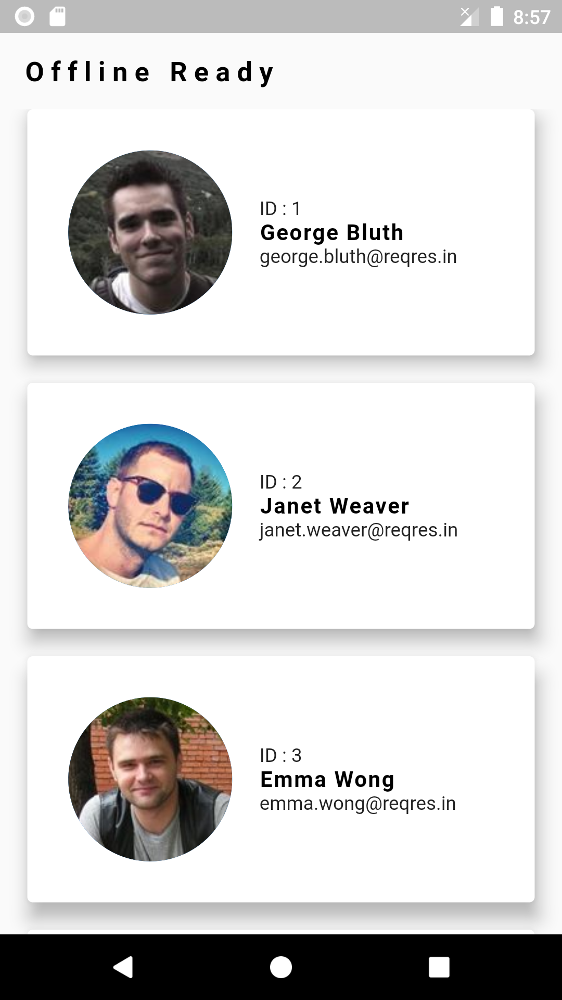

# Offline Ready Mobile Application

    A Flutter project build with the goal to make data available for use even when the internet is not available.

    Storage Used :
        -> File Storage
    Alternative : SharedPreference

Api :
-> [ReqRes Dummy Api](https://reqres.in/api/users?page=1)

    Features :
    -> Custom Fade Animation
    -> Data Available Offline
    -> Error Handling
    -> Refreshable

    
